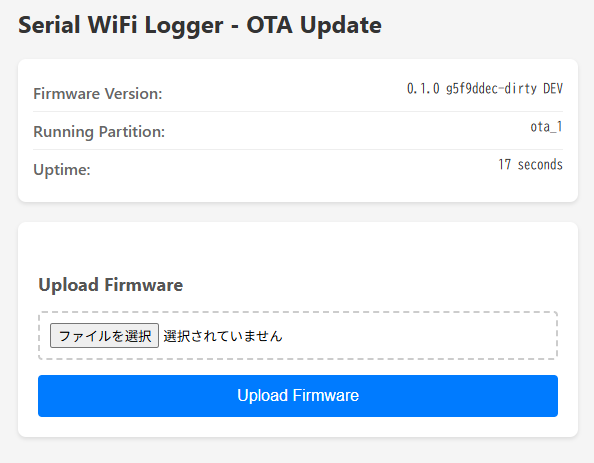

# Serial WiFi Logger

| 対応ターゲット | ESP32-S3 |
| ------------- | -------- |

## 概要

Serial WiFi Loggerは、ESP32-S3のUSB OTG機能を使用してUSBシリアルデバイスをネットワーク経由で利用可能にするファームウェアです。USB CDC-ACMデバイスとFTDIデバイスの両方に対応し、TCPソケット経由でシリアル通信を提供します。

## 主な機能

### 1. USB シリアルホスト機能
- **CDC-ACM対応**: 標準USB通信デバイスクラスのシリアルデバイスに対応
- **FTDI対応**: FTDI製USB-シリアル変換チップ (FT232R, FT2232など) に対応
- **自動検出**: USB VID/PIDに基づいてドライバを自動選択
- **データ転送**: USB → TCP、TCP → USB の双方向データブリッジ

### 2. WiFi ネットワークプロビジョニング
- **SoftAP方式**: 初回起動時にアクセスポイントを立ち上げ
- **自動接続**: 設定後は保存されたWiFi情報で自動接続
- **設定保存**: WiFi接続情報はNVSに永続的に保存

### 3. TCP サーバー機能
- **データポート**: 8888番 (変更可能)
- **制御ポート**: 8889番 (変更可能)
- **接続管理**: 各ポートで1クライアント接続をサポート
- **双方向通信**: USB ↔ TCP 間でリアルタイムデータ転送
- **シリアルポート制御**: DTR/RTS信号、ボーレート設定を制御ポート経由で制御可能

### 4. mDNS サービスディスカバリ
- **自動アドバタイズ**: ネットワーク上でデバイスを自動検出可能
- **サービス名**: `serial-XXXXXX._serial._tcp.local` (XXXXXXはMACアドレスの下位3バイト)
- **動的TXTレコード**: USB接続状態、TCP接続状態、デバイス情報をリアルタイム更新

### 5. OTA (Over-The-Air) ファームウェアアップデート
- **デュアルパーティション**: 安全なロールバック機能付き2面構成
- **HTTP Web UI**: ブラウザから簡単にファームウェア更新
- **自動ロールバック**: 新ファームウェアクラッシュ時に自動復旧
- **mDNS統合**: `http://serial-XXXXXX.local/` でアクセス可能
- **進捗表示**: リアルタイムアップロード進捗バー

## 必要なハードウェア

- **ESP32-S3 開発ボード** (USB OTG対応)
  - **最小フラッシュサイズ**: 2MB (OTA対応のため)
- **USB ケーブル** (プログラミング・モニタリング用)
- **USB シリアルデバイス**:
  - CDC-ACMデバイス (別のESP32-S3、Arduinoなど)
  - FTDIデバイス (FT232R USB-シリアル変換アダプタなど)

### ピン配置

ESP32-S3は内部USB OTGピンを使用:
- **GPIO 19**: USB D- (データ線負極)
- **GPIO 20**: USB D+ (データ線正極)

外部ピン設定は不要です。

### パーティション構成

OTA対応のデュアルパーティション構成:

| パーティション | タイプ | サブタイプ | オフセット | サイズ | 用途 |
|--------------|--------|-----------|-----------|--------|------|
| nvs | data | nvs | 0x9000 | 16KB | WiFi設定等の不揮発性ストレージ |
| otadata | data | ota | 0xd000 | 8KB | OTA起動パーティション管理 |
| phy_init | data | phy | 0xf000 | 4KB | RF校正データ |
| ota_0 | app | ota_0 | 0x10000 | 960KB | プライマリアプリケーション |
| ota_1 | app | ota_1 | 0x100000 | 960KB | セカンダリアプリケーション |

**合計使用:** 1984KB / 2048KB (64KB予備)

## ビルドとフラッシュ

### 1. リリースバイナリを使用する場合

GitHubのReleasesページから最新のファームウェアZIPファイルをダウンロードして使用できます。

**方法1: 自動フラッシュスクリプト（推奨）**

GitHubから自動的にファームウェアをダウンロードしてフラッシュするスクリプトを用意しています。

```bash
# 依存関係のインストール
pip3 install esptool

# 最新バージョンをフラッシュ（ポート自動検出）
./script/flash_firmware.sh

# 特定バージョンをフラッシュ
./script/flash_firmware.sh v0.2.0 /dev/ttyUSB0
```

詳細は [script/README.md](script/README.md#flash_firmwaresh) を参照してください。

**方法2: 個別バイナリを手動フラッシュ**

```bash
# ZIPファイルを展開後、以下のコマンドを実行
esptool.py --chip esp32s3 --port /dev/ttyUSB0 --baud 460800 write_flash \
  0x0 bootloader.bin \
  0x8000 partition-table.bin \
  0x10000 serial_wifi_logger.bin
```

**方法3: 単一イメージを手動フラッシュ**

```bash
# ZIPファイルを展開後、firmware-vX.X.X.binをフラッシュ
esptool.py --chip esp32s3 --port /dev/ttyUSB0 --baud 460800 write_flash \
  0x0 firmware-vX.X.X.bin
```

`/dev/ttyUSB0` をシリアルポートに置き換えてください (例: Linux では `/dev/ttyUSB0`, Windows では `COM3`)。

### 2. ソースからビルドする場合

**プロジェクトのビルド**

```bash
idf.py build
```

**ESP32-S3へのフラッシュ**

```bash
idf.py -p PORT flash monitor
```

`PORT`をシリアルポートに置き換えてください (例: Linux では `/dev/ttyUSB0`, Windows では `COM3`)。

シリアルモニタを終了するには `Ctrl-]` を入力してください。

## 初回セットアップ

### WiFi プロビジョニング

1. ファームウェア書き込み後、デバイスはSoftAPモードで起動します
2. SSID `PROV_XXXXXX` のWi-Fiアクセスポイントが表示されます
3. スマートフォンまたはPCでこのアクセスポイントに接続
4. ブラウザで `192.168.4.1` にアクセス
5. 接続先のWi-Fi SSID とパスワードを入力
6. デバイスが設定されたWi-Fiに接続し、以降は自動的に接続されます

プロビジョニング情報をリセットするには:
```bash
idf.py erase-flash
```

## OTAファームウェアアップデート

### リリースアーカイブからファームウェアを取得

GitHubのReleasesページからダウンロードしたZIPファイルには、OTAアップデート用のファームウェアが含まれています。

```bash
# ZIPファイルを展開
unzip serial_wifi_logger-vX.X.X.zip

# OTA用ファームウェアを確認
ls -lh serial_wifi_logger.bin
```

**ファイル:**
- `serial_wifi_logger.bin` - OTAアップデート用のアプリケーションバイナリ (約900KB)

このファイルをブラウザまたはcurlでアップロードします。

### 方法1: Webブラウザからアップデート（推奨）



1. **WebUIにアクセス**
   ```
   http://serial-XXXXXX.local/
   ```
   または直接IPアドレスで:
   ```
   http://<デバイスのIPアドレス>/
   ```

2. **デバイス情報を確認**
   - Firmware Version: 現在のバージョン
   - Running Partition: 現在起動中のパーティション (ota_0 または ota_1)
   - Uptime: 稼働時間

3. **ファームウェアをアップロード**
   - 「ファイルを選択」をクリック
   - `serial_wifi_logger.bin` を選択
   - 「Upload Firmware」ボタンをクリック

4. **アップロード完了を待機**
   - 進捗バーでアップロード状況を確認
   - 「Firmware uploaded successfully! Device will reboot in 3 seconds...」のメッセージを確認
   - デバイスが自動的に再起動

5. **新ファームウェアで起動**
   - 再起動後、新しいパーティション (ota_0 ↔ ota_1 が切り替わる) から起動
   - ブラウザで再読み込み (F5 または Ctrl+R) してWebUIに再接続
   - バージョンとRunning Partitionが更新されていることを確認

**注意:**
- アップロード中はデバイスへの他の操作を避けてください
- WiFi接続が安定していることを確認してください
- アップロードには約30-60秒かかります (ファームウェアサイズとWiFi速度による)

### 方法2: curlコマンドでアップデート

コマンドラインから直接ファームウェアをアップロードできます。

```bash
# デバイス情報を確認
curl http://serial-XXXXXX.local/api/info

# 出力例:
# {"version":"0.1.0 g5f9ddec DEV","partition":"ota_0","uptime":120}

# ファームウェアをアップロード
curl -X POST \
  --data-binary @serial_wifi_logger.bin \
  -H "Content-Type: application/octet-stream" \
  http://serial-XXXXXX.local/api/ota

# 成功時の応答: OK
```

**スクリプト例:**

```bash
#!/bin/bash
DEVICE="serial-A02048.local"
FIRMWARE="serial_wifi_logger.bin"

echo "Current device info:"
curl -s http://$DEVICE/api/info | jq .

echo -e "\nUploading firmware..."
RESPONSE=$(curl -X POST --data-binary @$FIRMWARE \
  -H "Content-Type: application/octet-stream" \
  -w "\nHTTP Status: %{http_code}\n" \
  http://$DEVICE/api/ota)

echo "$RESPONSE"

if echo "$RESPONSE" | grep -q "OK"; then
  echo "✓ Upload successful! Device will reboot in 3 seconds."
else
  echo "✗ Upload failed!"
  exit 1
fi
```

### 方法3: 自動OTAアップデートスクリプト（推奨）

GitHubリリースから自動的にファームウェアをダウンロードしてアップデートするスクリプトを用意しています。

**必要な依存関係:**
```bash
# Ubuntu/Debian
sudo apt-get install curl jq unzip

# macOS
brew install curl jq unzip
```

**使用方法:**
```bash
# 最新バージョンにアップデート
./script/ota_update.sh serial-A02048.local

# 特定バージョンにアップデート
./script/ota_update.sh serial-A02048.local v1.0.0

# IPアドレスで指定
./script/ota_update.sh 192.168.1.100 latest
```

**実行例:**
```bash
$ ./script/ota_update.sh serial-A02048.local
[INFO] OTA Firmware Update Tool
[INFO] Target device: serial-A02048.local
[INFO] Version: latest

[INFO] Fetching device information from http://serial-A02048.local/api/info

════════════════════════════════════════
  Device Information
════════════════════════════════════════
  Address:    serial-A02048.local
  Version:    0.1.0 g5f9ddec DEV
  Partition:  ota_0
  Uptime:     3600s
════════════════════════════════════════

Continue with OTA update? (y/N): y
[INFO] Fetching latest release information from GitHub...
[INFO] Found release: Serial WiFi Logger v1.0.0 (v1.0.0)
[INFO] Downloading firmware from: https://github.com/.../firmware-v1.0.0.zip
[INFO] Extracted firmware: 931K
[INFO] Uploading firmware to serial-A02048.local...
[SUCCESS] Firmware uploaded successfully!
[INFO] Device will reboot in 3 seconds...
[SUCCESS] OTA update completed successfully!
```

**環境変数:**
- `GITHUB_TOKEN`: プライベートリポジトリの場合、GitHubパーソナルアクセストークンを設定
- `DEBUG`: デバッグモードを有効化（`DEBUG=1`で詳細なログ出力）

**スクリプトの機能:**
- GitHubから最新または指定バージョンのリリースを取得
- ファームウェアZIPファイルを自動ダウンロード
- デバイス情報の確認（アップデート前）
- ファームウェアのアップロード
- アップデート後の検証
- エラーハンドリングと詳細なログ出力
- デバッグモード対応

**トラブルシューティング:**

問題が発生した場合は、デバッグモードで実行してください:
```bash
DEBUG=1 ./script/ota_update.sh serial-A02048.local v0.2.0
```

詳細なトラブルシューティング情報は [script/README.md](script/README.md) を参照してください。

### 方法4: IPアドレスを直接指定

mDNSが利用できない環境では、IPアドレスを直接使用できます。

```bash
# デバイスのIPアドレスを確認 (シリアルモニタやmDNS検索)
IP_ADDRESS=192.168.1.100

# Webブラウザでアクセス
open http://$IP_ADDRESS/

# またはcurlでアップロード
curl -X POST --data-binary @serial_wifi_logger.bin \
  -H "Content-Type: application/octet-stream" \
  http://$IP_ADDRESS/api/ota
```

### OTA HTTP API

#### GET /api/info
デバイス情報をJSON形式で取得

**レスポンス例:**
```json
{
  "version": "0.1.0 g5f9ddec DEV",
  "partition": "ota_1",
  "uptime": 3600
}
```

#### POST /api/ota
ファームウェアバイナリをアップロード

**リクエスト:**
- Content-Type: `application/octet-stream`
- Body: ファームウェアバイナリ (raw binary)

**レスポンス:**
- 成功: `200 OK` + `"OK"` ボディ
- 失敗: `400 Bad Request` または `500 Internal Server Error` + エラーメッセージ

**検証:**
- ファームウェアサイズ: 最大960KB
- マジックバイト: 0xE9 (ESP32アプリケーションヘッダー)
- SHA256チェックサム: 自動検証

### トラブルシューティング (OTA)

#### アップロードが失敗する

**原因1: ファームウェアサイズ超過**
```
Error: Firmware too large
```
- ファームウェアサイズが960KBを超えています
- コンパイラ最適化を確認: `CONFIG_COMPILER_OPTIMIZATION_SIZE=y`

**原因2: 不正なファームウェアフォーマット**
```
Error: Invalid firmware format
```
- `serial_wifi_logger.bin` を使用していることを確認
- `firmware-vX.X.X.bin` (統合イメージ) ではなく、アプリケーションバイナリを使用

**原因3: ネットワーク接続エラー**
```
Error: Connection error
```
- WiFi接続が安定していることを確認
- デバイスとクライアントが同じネットワークにあることを確認

#### 新ファームウェアで起動しない

デバイスは自動的にロールバックします:

1. **自動ロールバック**
   - 新ファームウェアがクラッシュした場合
   - ブートローダーが自動的に前のパーティションに戻します
   - 再起動後、元のファームウェアで起動

2. **手動確認**
   ```bash
   # WebUIまたはAPIで現在のパーティションを確認
   curl http://serial-XXXXXX.local/api/info | jq .partition
   ```

3. **シリアルログ確認**
   ```bash
   idf.py monitor
   ```
   ログで以下を確認:
   - `Running from partition: ota_X`
   - `First boot after OTA, marking app as valid`

#### mDNSでアクセスできない

```bash
# IPアドレスを直接使用
curl http://192.168.1.100/api/info

# またはmDNS検索
avahi-browse -r _http._tcp
```

## 使用方法

### 1. デバイスの検出

WiFi接続後、mDNSでデバイスを検出できます:

**macOS/Linux:**
```bash
# サービス一覧を表示
dns-sd -B _serial._tcp

# 詳細情報を表示
dns-sd -L serial-XXXXXX _serial._tcp
```

または

```bash
avahi-browse -r _serial._tcp
```

```
$ avahi-browse -rt _serial._tcp
+ enp5s0 IPv4 serial-A02048                                 _serial._tcp         local
= enp5s0 IPv4 serial-A02048                                 _serial._tcp         local
   hostname = [serial-A02048.local]
   address = [192.168.2.125]
   port = [8888]
   txt = ["mac=f4:12:fa:a0:20:48" "ip=192.168.2.125" "port=8888" "usb_connected=1" "tcp_connected=0" "usb_vid=0x0403" "usb_pid=0x6015" "usb_type=FTDI"]
```

**Windows:**
- Bonjour Browserなどのツールを使用

### 2. データポートへの接続

検出したIPアドレスとポート8888に接続してデータ通信:

```bash
# telnet で接続
telnet <IP_ADDRESS> 8888

# nc (netcat) で接続
nc <IP_ADDRESS> 8888

# Python での接続例
python3 -c "
import socket
s = socket.socket()
s.connect(('IP_ADDRESS', 8888))
s.send(b'Hello\\n')
print(s.recv(1024))
"
```

### 3. 制御ポートでのシリアルポート制御

制御ポート（8889番）に接続してDTR/RTS信号やボーレートを制御:

```bash
# 制御ポートに接続
telnet <IP_ADDRESS> 8889

# DTRを1に設定（HIGH）
DTR 1
# 応答: OK

# DTRを0に設定（LOW）
DTR 0
# 応答: OK

# RTSを1に設定（HIGH）
RTS 1
# 応答: OK

# RTSを0に設定（LOW）
RTS 0
# 応答: OK

# ボーレートを9600bpsに設定
BAUD 9600
# 応答: OK

# ボーレートを115200bpsに設定
BAUD 115200
# 応答: OK
```

**対応コマンド:**
- `DTR 0` / `DTR 1` - DTR信号の制御
- `RTS 0` / `RTS 1` - RTS信号の制御
- `BAUD <baudrate>` - ボーレート設定（300～921600bps）

**応答:**
- `OK` - コマンド成功
- `ERROR` - コマンド失敗（USBデバイス未接続、無効なコマンドなど）

### 4. USBシリアルデバイスの接続

1. USBシリアルデバイスをESP32-S3のUSBポートに接続
2. デバイスが自動的に検出され、ドライバが選択されます
3. TCP接続が確立されていれば、即座にデータ通信が可能になります

## mDNS TXTレコード

以下の情報がmDNS TXTレコードとして公開されます:

### _serial._tcp サービス

| キー | 説明 | 例 |
|-----|------|---|
| `mac` | デバイスMACアドレス | `AA:BB:CC:DD:EE:FF` |
| `ip` | デバイスIPアドレス | `192.168.1.100` |
| `port` | TCPデータポート番号 | `8888` |
| `control_port` | TCP制御ポート番号 | `8889` |
| `usb_connected` | USB接続状態 | `0` / `1` |
| `usb_vid` | USB Vendor ID (接続時のみ) | `0x0403` |
| `usb_pid` | USB Product ID (接続時のみ) | `0x6001` |
| `usb_type` | USBドライバタイプ (接続時のみ) | `CDC` / `FTDI` |
| `tcp_connected` | TCPクライアント接続状態 | `0` / `1` |
| `ota_enabled` | OTA機能有効状態 | `1` |
| `ota_url` | OTA WebUI URL | `http://serial-XXXXXX.local/` |

### _http._tcp サービス (OTA用)

| キー | 説明 | 例 |
|-----|------|---|
| `path` | WebUIパス | `/` |
| `ota` | OTA機能 | `enabled` |
| `version` | ファームウェアバージョン | `0.1.0 g5f9ddec DEV` |

## 対応デバイス

### CDC-ACMデバイス
- ESP32-S3 (TinyUSB CDC)
- CDC-ACMプロトコルを実装したUSBデバイス全般

### FTDIデバイス
- FT232R (シングルポート)
- FT2232H (デュアルポート)
- FT4232H (クアッドポート)
- FT232H (高速シングルポート)
- VID `0x0403` を持つ他のFTDIチップ

## 設定

### TCP ポート番号の変更

`idf.py menuconfig` → `TCP Server Configuration`

- **TCP Data Port**: データポート番号（デフォルト: 8888）
- **TCP Control Port**: 制御ポート番号（デフォルト: 8889）
- **TCP RX Buffer Size**: TCP受信バッファサイズ（デフォルト: 512バイト）

### OTA アップデート設定

`idf.py menuconfig` → `OTA Update Configuration`

- **HTTP Server Port**: HTTPサーバーポート番号（デフォルト: 80）
- **Maximum Firmware Size**: 最大ファームウェアサイズ（デフォルト: 983040バイト = 960KB）
- **Enable Automatic Rollback**: 自動ロールバック有効化（デフォルト: 有効）

### WiFi 再試行回数の変更

`idf.py menuconfig` → `Network Provisioning Configuration` → `Maximum WiFi connection retry`

デフォルト: 5回

### バッファサイズの変更

`idf.py menuconfig` → `TCP Server Configuration` → `Data Buffer Pool Size`

デフォルト: 16バッファ

## トラブルシューティング

### WiFiに接続できない

1. プロビジョニング情報を消去して再設定:
   ```bash
   idf.py erase-flash
   idf.py flash monitor
   ```

2. WiFi設定を確認 (SSID、パスワード)

3. WiFi信号強度を確認

### USBデバイスが認識されない

1. USB接続を確認
2. USBデバイスが正常に動作していることをPCで確認
3. ESP32-S3のUSB OTGが有効になっていることを確認
4. デバッグログを有効化:
   ```bash
   idf.py menuconfig
   ```
   Component config → Log output → Default log verbosity → Debug

### TCPで接続できない

1. デバイスとクライアントが同じネットワーク上にあることを確認
2. ファイアウォール設定を確認
3. IPアドレスとポート番号を確認
4. `telnet <IP> 8888` で接続テスト

### mDNSでデバイスが見つからない

1. mDNSが有効なネットワークであることを確認
2. デバイスがWiFiに接続されていることを確認
3. mDNSクライアントツールが正しくインストールされていることを確認
4. シリアルモニタでmDNS初期化ログを確認

## コンポーネント

### FTDI SIO Host Driver
カスタムコンポーネント: `components/usb_host_ftdi_sio/`
- FTDI固有のUSB制御リクエスト
- デバイス管理とバルク転送
- FTDIチップタイプ検出

詳細は [components/usb_host_ftdi_sio/README.md](components/usb_host_ftdi_sio/README.md) を参照。

### ESP-IDF Managed Components
- `espressif/usb_host_cdc_acm`: CDC-ACMホストドライバ
- `espressif/network_provisioning`: WiFiプロビジョニング
- `espressif/mdns`: mDNSサービスディスカバリ

## 制限事項

- **シーケンシャル処理**: 一度に1つのUSBデバイスのみ処理
- **単一TCP接続**: 同時に1つのTCPクライアントのみサポート
- **マルチインターフェース非対応**: マルチポートFTDIデバイスは最初のインターフェースのみ使用
- **VID優先ルーティング**: VID `0x0403` のデバイスは常にFTDIドライバにルーティング

## ライセンス

このプロジェクトは Apache License 2.0 の下でライセンスされています。

個々のコンポーネントのライセンスについては、各コンポーネントのREADMEを参照してください。

## 参考資料

- [ESP-IDF USB Host ドキュメント](https://docs.espressif.com/projects/esp-idf/en/latest/esp32s3/api-reference/peripherals/usb_host.html)
- [USB CDC-ACM 仕様](https://www.usb.org/document-library/class-definitions-communication-devices-12)
- [FTDI チップ データシート](https://ftdichip.com/product-category/products/ic/)
- [ESP32-S3 USB OTG](https://docs.espressif.com/projects/esp-idf/en/latest/esp32s3/api-reference/peripherals/usb_host.html)
