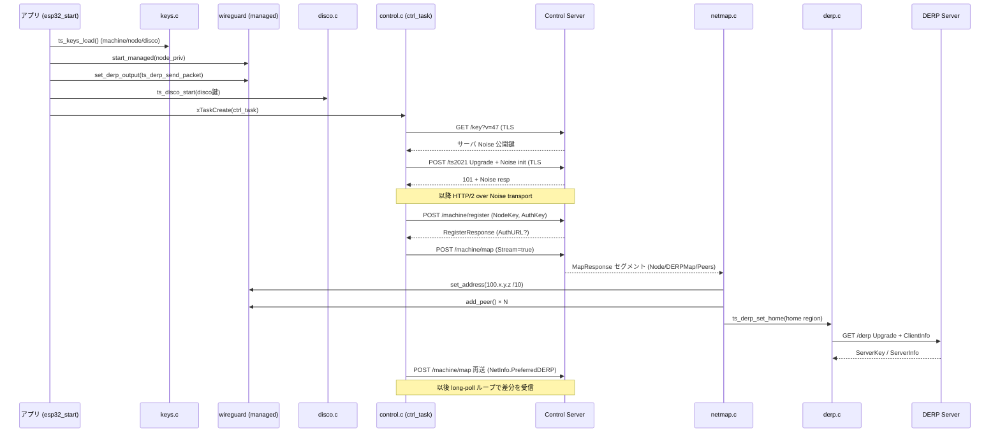
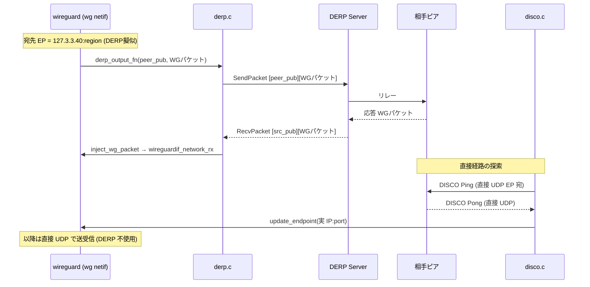

# Tailscale クライアント実装ドキュメント

`components/tailscale` は ESP32 (ESP-IDF 6.0) 上で動作する最小限の Tailscale
クライアントである。Go 製の公式 `tailscaled` が行う処理のうち、ESP32 で
WireGuard トンネルを確立し、他の tailnet ノードと通信するために必須の機能だけ
を C で再実装している。

このドキュメントでは以下を説明する。

- [全体アーキテクチャ](#1-全体アーキテクチャ)
- [鍵管理 (3 種類の curve25519 鍵)](#2-鍵管理)
- [WireGuard コンポーネントとのつながり](#3-wireguard-コンポーネントとのつながり)
- [コントロールプレーン (ts2021 / Noise / HTTP-2 / JSON API)](#4-コントロールプレーン-ts2021)
- [DERP リレー](#5-derp-リレー)
- [DISCO 経路探索](#6-disco-経路探索)
- [全体シーケンス](#7-全体シーケンス)
- [データ経路 (パケットの流れ)](#8-データ経路パケットの流れ)
- [参考資料](#9-参考資料)

---

## 1. 全体アーキテクチャ

Tailscale は「コントロールプレーン」と「データプレーン」を明確に分離した
アーキテクチャを持つ。

- **コントロールプレーン**: コーディネーションサーバ
  (`login.tailscale.com` または Headscale) と通信し、自分の IP アドレス・
  ピア一覧・DERP サーバ一覧 (ネットワークマップ) を取得する。**鍵交換そのもの
  は行わず、公開鍵やエンドポイント情報の「配布」のみ**を担う。
- **データプレーン**: 取得したピア情報をもとに WireGuard で暗号化トンネルを
  張り、実際のパケットをやり取りする。直接 UDP が通らない場合は DERP リレーを
  経由し、DISCO で直接経路へ昇格を試みる。

```
                       ┌─────────────────────────────────────────┐
                       │           tailscale component            │
                       │                                          │
  ┌──────────────┐     │  ┌────────────┐    ┌──────────────────┐  │
  │ Control       │◀───┼─▶│ control.c  │    │ keys.c           │  │
  │ Server        │TLS  │  │ (ts2021/H2)│    │ machine/node/    │  │
  │ login.ts.com  │     │  └─────┬──────┘    │ disco 鍵 (NVS)   │  │
  └──────────────┘     │        │           └──────────────────┘  │
                       │        │ MapResponse(JSON)                │
  ┌──────────────┐     │  ┌─────▼──────┐                          │
  │ DERP Server   │◀───┼─▶│ netmap.c   │ ピア追加/削除/EP更新       │
  │ (relay, TLS)  │     │  └─────┬──────┘                          │
  └──────┬───────┘     │        │                                  │
         │ relay        │  ┌─────▼──────┐    ┌──────────────────┐  │
         └─────────────┼─▶│ derp.c     │    │ disco.c          │  │
                       │  │ (TLS relay)│    │ (UDP 経路探索)   │  │
                       │  └─────┬──────┘    └────────┬─────────┘  │
                       │        │ inject               │ ping/pong  │
                       │        ▼                       ▼           │
                       │  ┌────────────────────────────────────┐   │
                       │  │     wireguard component (managed)   │   │
                       │  │     lwIP "wg" netif + 暗号化         │   │
                       │  └────────────────────────────────────┘   │
                       └─────────────────────────────────────────┘
```

### ソースファイルの役割

| ファイル | 役割 |
|----------|------|
| `tailscale_esp32.c`   | 公開 API・初期化・コントロールタスクの起動 (`tailscale_esp32_start` 等) |
| `tailscale_keys.c`    | machine / node / disco の 3 鍵生成・NVS 永続化・hex エンコード |
| `tailscale_noise.c`   | ts2021 の Noise IK ハンドシェイクと transport 暗号化 |
| `tailscale_control.c` | TLS → HTTP/1.1 upgrade → Noise → HTTP/2 → JSON API。Register / MapRequest / long-poll |
| `tailscale_netmap.c`  | MapResponse(JSON) のストリーミング解析と WireGuard ピア表の同期 |
| `tailscale_jstream.c` | SAX 風ストリーミング JSON パーサ (cJSON の代替、省メモリ) |
| `tailscale_derp.c`    | DERP リレークライアント (TLS、フレーム送受信、WG パケット注入) |
| `tailscale_disco.c`   | DISCO 経路探索 (UDP、Ping/Pong、直接経路への昇格) |

---

## 2. 鍵管理

`tailscale_keys.c` は **3 種類の curve25519 鍵ペア**を管理する。いずれも
NVS namespace `"tailscale"` に秘密鍵を保存し、初回起動時に生成、以降は再ロード
する (`ts_keys_load`)。秘密鍵は RFC 7748 のクランプを施す。

| 鍵 | NVS キー | 用途 |
|----|----------|------|
| **machine** | `machine_priv` | 長期的なデバイス ID。ts2021 の Noise IK ハンドシェイクで使用 (コントロールチャネルの認証) |
| **node**    | `node_priv`    | WireGuard データプレーン鍵。コントロールサーバには `NodeKey` として登録。DERP 認証にも使用 |
| **disco**   | `disco_priv`   | DISCO 経路探索用の鍵。コントロールサーバには `DiscoKey` として登録 |

公開鍵は秘密鍵から都度導出する (`x25519(priv, basepoint=9)`)。JSON API では
`nodekey:HEX` / `discokey:HEX` という接頭辞付き hex 文字列で表現する
(`ts_key_to_hex` / `ts_key_from_hex`)。

> **重要**: node 鍵 = WireGuard の秘密鍵である。tailscale コンポーネントは
> この node 鍵を base64 化して `wireguard_esp32_start_managed()` に渡すため、
> WireGuard が張るトンネルの公開鍵と、コントロールサーバへ登録する `NodeKey`
> は一致する。

---

## 3. WireGuard コンポーネントとのつながり

tailscale コンポーネントは独自に暗号トンネルを実装せず、`components/wireguard`
の **managed モード** を利用する。両者の接点は以下の関数群 (すべて
`wireguard_esp32.h` で定義)。

### 起動時の接続 (`tailscale_esp32_start`)

```c
/* node 鍵を base64 にして WireGuard を managed モードで起動 */
wireguard_esp32_start_managed(node_priv_b64,
                              NULL,   /* IP は後でコントロールサーバが割り当て */
                              NULL,   /* netmask も後で設定 */
                              CONFIG_TAILSCALE_LISTEN_PORT /* 既定 41641 */);

/* DERP 出力フックを登録 (後述) */
wireguard_esp32_set_derp_output(ts_derp_send_packet);
```

- WireGuard は lwIP のネットワークインタフェース (netif 名 `"wg"`) を生成する。
- 起動時点ではピアもローカル IP も未確定。**コントロールサーバから取得した
  情報で後から構成される**。

### ネットマップ適用時の接続 (`tailscale_netmap.c`)

MapResponse を解析した結果、`netmap.c` が WireGuard の以下 API を呼ぶ。

| WireGuard API | 呼び出し契機 |
|---------------|--------------|
| `wireguard_esp32_set_address(ip, mask)` | 自ノードの Tailscale IP (`Node.Addresses` の 100.x.y.z) を確定。マスクは `/10` (`255.192.0.0`) で 100.64.0.0/10 CGNAT 全体を wg netif へルーティング |
| `wireguard_esp32_add_peer(...)` | 新規ピアを追加。`AllowedIP` はピアの 100.x.y.z `/32`、エンドポイントは直接 EP か DERP 擬似 EP |
| `wireguard_esp32_update_endpoint(idx, ip, port)` | 既存ピアのエンドポイント更新 (DISCO 成功時の直接経路昇格など) |
| `wireguard_esp32_remove_peer(idx)` | `PeersRemoved` / フルスナップショットから消えたピアを削除 |

### DERP 擬似エンドポイント (127.3.3.0/24)

直接 UDP エンドポイントが分からないピアには、エンドポイントとして
**`127.3.3.40:<DERP region ID>`** を設定する。WireGuard 側は出力時にこの
特殊レンジ宛のパケットを検出すると、UDP 送信せず登録済みの DERP 出力フック
(`ts_derp_send_packet`) を呼ぶ。これにより「WireGuard はリレーの存在を意識
せず」DERP 経由でパケットを送れる。

```c
/* netmap.c: 直接 EP がなく DERP region のみ判明している場合 */
ip4addr_aton("127.3.3.40", &derp4);
ep_port = (uint16_t)p->derp_region;   /* port に region ID を埋める */
```

### 受信側の注入 (`inject_wg_packet`)

DERP から受信した WireGuard パケットは生の UDP ペイロードなので、IP 層
(`tcpip_input`) ではなく `wireguardif_network_rx()` に渡す必要がある。
`derp.c` の `inject_wg_packet()` が `"wg"` netif を探し、擬似送信元
`127.3.3.40:<region>` を付けて `wireguardif_network_rx()` を直接呼ぶ。
復号後の返信パケットも同じ擬似 EP を経由するため、DERP 出力フックへ正しく
戻る。

---

## 4. コントロールプレーン (ts2021)

`tailscale_control.c` は Tailscale の **ts2021** コントロールプロトコルを
実装する。プロトコルスタックは下から順に以下のとおり。

```
  TLS (mbedTLS)
    └─ HTTP/1.1 Upgrade  (POST /ts2021)
         └─ Noise IK ハンドシェイク (Noise_IK_25519_ChaChaPoly_BLAKE2s)
              └─ HTTP/2 (Noise transport で 1 フレーム = 1 Noise レコード)
                   └─ JSON API (/machine/register, /machine/map)
```

主要な定数: Cap-Version = `47`、Tailscale-Version = `1.56.0`、
RegisterRequest/MapRequest の `Version` = `65`。

### 4.1 サーバ Noise 公開鍵の取得 — `GET /key`

最初の TLS 接続で `GET /key?v=47` を発行し、サーバの Noise static 公開鍵を
取得する。レスポンスは JSON (`{"publicKey":"..."}`) か生 hex のどちらでも
解釈できる。この接続は `Connection: close` で一度切る。

### 4.2 Noise IK ハンドシェイク — `tailscale_noise.c`

2 本目の TLS 接続で `POST /ts2021` の HTTP/1.1 Upgrade を行う。Noise の
initiator メッセージ (101 バイト) を base64 化して `X-Tailscale-Handshake`
ヘッダに載せる。

- **プロトコル**: `Noise_IK_25519_ChaChaPoly_BLAKE2s`
- **HKDF**: RFC 5869 標準 HKDF を HMAC-BLAKE2s で実装 (WireGuard の keyed-BLAKE2s
  HKDF とは異なる点に注意)
- **Prologue**: `"Tailscale Control Protocol v1"`
- machine 鍵を static 鍵、サーバ Noise 鍵を相手 static 鍵として IK パターンを実行

メッセージ形式:

```
Init (101B): [2B version=1][1B type=0x01][2B len=96][32B 一時公開鍵][48B enc_static][16B enc_empty]
Resp ( 51B): [1B type=0x02][2B len=48][32B サーバ一時公開鍵][16B enc_empty(AEADタグ)]
```

サーバ応答 (51 バイト) を受けて `ts_noise_finish()` がハンドシェイクを完了し、
`send_key` / `recv_key` を `Split()` で導出する。以降の通信はこの鍵で
AEAD (ChaCha20-Poly1305、nonce はビッグエンディアン) 暗号化される。

### 4.3 Noise transport 上の HTTP/2

ハンドシェイク後、コントロールチャネルは **Noise transport の上で HTTP/2** を
話す。1 つの HTTP/2 フレームを 1 つの Noise レコードに包む。Noise レコードの
ワイヤ形式:

```
[1B type=0x04 (DATA)][2B BE 暗号文長][暗号文 (HTTP/2フレーム + 16B AEADタグ)]
```

- 送信: HTTP/2 フレームを組み立て → `ts_noise_encrypt` → Noise ヘッダ付与 → TLS write
- 受信: TLS read → Noise レコード復号 → HTTP/2 フレームパーサへ供給 (`h2_fill`/`h2_read`)
- HPACK は静的テーブルのみの最小実装 (Huffman 非対応)。送信ヘッダ生成は
  `h2_encode_req_headers`、受信は `:status` 抽出のみ (`h2_decode_status`)。
- 接続確立時にクライアントプリフェイス + 空 SETTINGS を送る。サーバが
  "EarlyPayload" (マジック `0xFF 0xFF 0xFF 'T' 'S'`) を送ってきた場合は読み捨てる。
- SETTINGS / PING / WINDOW_UPDATE は `h2_handle_ctrl_frame` で自動応答。

### 4.4 RegisterRequest — `POST /machine/register`

デバイス登録。HTTP/2 の通常 POST (HEADERS + DATA、END_STREAM まで読む)。
JSON ボディの主なフィールド:

```json
{
  "Version": 65,
  "NodeKey": "nodekey:<hex>",
  "OldNodeKey": "nodekey:<hex>",
  "Auth": { "AuthKey": "tskey-auth-..." },   // auth_key がある場合のみ
  "Hostinfo": { "OS": "linux", "Hostname": "...", "GoArch": "arm", ... },
  "Endpoints": []
}
```

レスポンスに **`AuthURL`** が含まれる場合、そのデバイスはまだ承認されておらず、
tailnet メンバーがブラウザで URL を開いて承認するまで通信できない。この URL は
`ts_ctrl_get_auth_url()` で取得でき、Web UI に表示される
(`tailscale_esp32_get_auth_url`)。`AuthKey` が有効なら `AuthURL` は空になる。

### 4.5 MapRequest — `POST /machine/map` (ストリーミング)

ネットワークマップを取得する。`Stream: true` を指定し、サーバは
**long-poll でストリーミング応答**する。1 本の HTTP/2 ストリーム上で
DATA フレームが流れ続け、その中身は次の形式のセグメントが連続する。

```
[4B LE セグメント長][JSON 本体] [4B LE セグメント長][JSON 本体] ...
```

MapRequest JSON の主なフィールド:

```json
{
  "Version": 65,
  "NodeKey": "nodekey:<hex>",
  "DiscoKey": "discokey:<hex>",
  "Stream": true,
  "IncludeIPv6": false,
  "OmitPeers": false,
  "Hostinfo": {
    "OS": "linux", "Hostname": "...",
    "NetInfo": { "PreferredDERP": <region>, "LinkType": "wired" }  // 2回目以降
  }
}
```

最初の MapRequest 時点では自分の DERP region がまだ不明なので `NetInfo` を
付けられない。最初の MapResponse で DERPMap を解析し home region が判明したら、
**コントロールタスクが MapRequest を再送**し、`NetInfo.PreferredDERP` を広告
する。これにより他ピアは「このノード宛のパケットをどの DERP に中継すべきか」
を知る。

セグメント用バッファは断片化回避のため、一度確保したら拡張のみで縮小しない
永続バッファ (`s_map_persistent_buf`) を使う。最大 256KB。OOM 時はセグメントを
読み捨ててストリームの整列を保つ。

### 4.6 MapResponse の解析 — `tailscale_netmap.c`

MapResponse の JSON は数十 KB に達するため、cJSON のツリー構築はメモリを
圧迫する。そこで **SAX 風ストリーミングパーサ `ts_js`** (`tailscale_jstream.c`)
を使い、入力バッファ長 + O(深さ) だけのメモリで解析する。

トップレベルで処理するキー:

| キー | 処理 |
|------|------|
| `Node`         | 自ノードの `Addresses[0]` から Tailscale IP を確定し `wireguard_esp32_set_address` |
| `DERPMap`      | `Regions` を走査し、有効な `Nodes[0]` を持つ最小 region ID を home DERP に選定 |
| `Peers`        | フルスナップショット。全ピアを追加/更新し、含まれないピアは削除 |
| `PeersChanged` | 差分更新。該当ピアのみ追加/更新 (削除はしない) |
| `PeersRemoved` | NodeID 配列。該当ピアを WireGuard から削除 |
| `KeepAlive`    | キープアライブ通知 (内容なし) |

各ピアからは `Key`(NodeKey)、`ID`(NodeID)、`DiscoKey`、`Addresses`(100.x.y.z)、
`Endpoints`(直接 EP)、`DERP`(region) を抽出する。直接 EP があれば DISCO Ping を
試み、なければ DERP 擬似 EP を設定する (前述)。

### 4.7 long-poll ループ — `ts_ctrl_poll_loop`

初回 MapResponse 処理後はこのループに入り、ストリームから差分 MapResponse
セグメントを読み続けて `ts_netmap_apply()` を呼ぶ。受信エラー時は 10 秒待って
再登録 + 再 MapRequest を行う。`ctrl_task` 全体は登録失敗時 30 秒、MapRequest
失敗時 10 秒のリトライで永続的に接続を維持する。

---

## 5. DERP リレー

**DERP (Detour Encrypted Routing Protocol)** は、NAT やファイアウォールで
ピア間の直接 UDP が通らないときに、HTTPS (TLS) で常時接続した中継サーバを
介して WireGuard パケットを運ぶ仕組み。WireGuard の暗号化はそのまま、外側を
DERP がリレーするだけなので **DERP サーバは中身を復号できない** (E2E 暗号は
WireGuard が担保)。

`tailscale_derp.c` の実装:

### 接続確立 (`ts_derp_connect` / `derp_http_upgrade`)

1. home DERP サーバへ TLS 接続 (port 443)。
2. `GET /derp` の HTTP/1.1 `Upgrade: DERP` を送り、`101` を待つ。
3. **ServerKey フレーム (type 0x01)** を受信: `[8B マジック][32B サーバ X25519 公開鍵]`。
4. **ClientInfo フレーム (type 0x02)** を送信:
   ```
   [32B node 公開鍵][NaCl box: 24B nonce + 16B Poly1305 タグ + 暗号文({"version":2})]
   ```
   共有鍵 = `X25519(node_priv, srv_pub)`、暗号は **NaCl secretbox
   (XSalsa20-Poly1305)**。HSalsa20/Salsa20/Poly1305 は `derp.c` 内に自前実装。
5. **ServerInfo フレーム (type 0x03)** を受信して接続完了。

### フレーム形式

```
[1B フレームタイプ][4B BE ペイロード長][ペイロード]
```

主なタイプ (`tailscale_derp.h`):

| 値 | 名前 | 用途 |
|----|------|------|
| 0x01 | ServerKey   | サーバ公開鍵 (受信) |
| 0x02 | ClientInfo  | クライアント情報 (送信) |
| 0x03 | ServerInfo  | サーバ情報 (受信) |
| 0x04 | SendPacket  | パケット送信 `[32B 宛先公開鍵][WGパケット]` |
| 0x05 | RecvPacket  | パケット受信 `[32B 送信元公開鍵][WGパケット]` |
| 0x06 | KeepAlive   | キープアライブ (15 秒ごと) |
| 0x08 | PeerGone    | ピア切断通知 |

### スレッド構成

- **`derp_recv_task`**: フレームを受信し、`RecvPacket` なら `inject_wg_packet()`
  で WireGuard netif へ注入。SO_RCVTIMEO を 20 秒に設定。
- **`derp_tx_task`**: 送信はキュー (`s_tx_queue`) 経由でこのタスクに集約。
  TLS write が lwIP の tcpip スレッド (LOCK_TCPIP_CORE 保持中) をブロックする
  のを避けるため、実際の write は必ずこのタスクで `s_tx_mutex` 下に行う。
- **`derp_ka_task`**: 15 秒ごとに KeepAlive フレームをキューへ投入。

`ts_derp_set_home()` は home DERP が変わったときに別タスクで再接続する。
WireGuard からの出力フック `ts_derp_send_packet()` は `ts_derp_send()` を呼び、
`SendPacket` フレームをキューに積む。

---

## 6. DISCO 経路探索

**DISCO** は、いったん DERP リレー経由で疎通したピアとの間で **直接 UDP 経路**
を探索し、可能ならリレーを介さない低遅延・高帯域の経路へ「昇格」させる
プロトコル。`tailscale_disco.c` が実装する。

### パケット形式

```
["TS💬" マジック 6B (54 53 f0 9f 92 ac)]
[nonce 24B]
[box = XChaCha20-Poly1305(key = X25519(disco_priv, peer_disco_pub),
                          plaintext = [1B type][payload])]
```

| type | 名前 | payload |
|------|------|---------|
| 0x01 | Ping | `[8B tx ID]` |
| 0x02 | Pong | (tx ID を含む) |

### 動作

1. **Ping 送信** (`ts_disco_ping`): netmap がピアの直接エンドポイントを得た
   ときに呼ばれる。ランダムな 8 バイト tx ID を生成、DISCO box で暗号化し、
   ピアの直接 EP へ UDP 送信。送信先と peer index を pending テーブルに登録。
2. **Pong 受信** (`disco_recv_task`): UDP ソケットで待ち受け、マジックを検証後、
   pending 中の各ピアの DISCO 公開鍵で box の復号を試みる。Pong を復号できたら、
   **その UDP 送信元アドレスを直接経路として `wireguard_esp32_update_endpoint()`
   でピアのエンドポイントを更新** (DERP 擬似 EP から実 EP へ昇格)。

`CONFIG_TAILSCALE_DERP_ONLY` を有効にすると DISCO 直接経路を無効化し、全トラ
フィックを DERP 経由に固定できる (直接 UDP がブロックされる網やデバッグ用)。

> なお現実装の Pong 突合せは pending テーブルを総当たりする簡略版で、送信元
> アドレスとの厳密な対応付けは行っていない。

---

## 7. 全体シーケンス

### 7.1 起動からトンネル確立まで



### 7.2 ピア通信: DERP 経由 → 直接経路への昇格



---

## 8. データ経路 (パケットの流れ)

### 送信 (アプリ → ピア)

1. アプリが `100.x.y.z` (ピアの Tailscale IP) 宛に IP パケットを送る。
2. lwIP のルーティングで `"wg"` netif へ (自ノードに `/10` が割り当て済み)。
3. `wireguardif` が node 鍵 ↔ ピア公開鍵のセッション鍵でパケットを暗号化。
4. ピアのエンドポイント次第で分岐:
   - **直接 EP** (実 IP:port) → 通常の UDP 送信。
   - **DERP 擬似 EP** (`127.3.3.0/24`) → 出力フック `ts_derp_send_packet`
     → DERP `SendPacket` フレーム。

### 受信 (ピア → アプリ)

- **直接 UDP** の場合: lwIP の UDP スタックが `wireguardif` の udp_pcb に配送 →
  復号 → IP 層へ。
- **DERP 経由** の場合: `derp_recv_task` が `RecvPacket` を受信 →
  `inject_wg_packet()` が `"wg"` netif を探し、擬似送信元
  `127.3.3.40:<region>` で `wireguardif_network_rx()` を直接呼ぶ →
  復号 → IP 層へ。

このように **WireGuard 層は「直接 UDP か DERP リレーか」を擬似エンドポイント
アドレスだけで区別**し、暗号化・復号のロジックは経路に依存しない。DISCO が
直接経路を見つければエンドポイントが実 IP に差し替わり、以降は自動的に
直接通信へ切り替わる。

---

## 付録: 設定 (Kconfig / NVS)

| Kconfig | NVS キー (namespace `tailscale`) | 既定値 | 説明 |
|---------|----------------------------------|--------|------|
| `TAILSCALE_AUTH_KEY`       | `auth_key`    | `""` | 事前認証キー `tskey-auth-...` |
| `TAILSCALE_HOSTNAME`       | `hostname`    | `esp32-serial` | tailnet 上のホスト名 |
| `TAILSCALE_CONTROL_SERVER` | `ctrl_server` | `login.tailscale.com` | コントロールサーバ (Headscale も可) |
| `TAILSCALE_LISTEN_PORT`    | —             | `41641` | WireGuard UDP リッスンポート |
| `TAILSCALE_DERP_ONLY`      | —             | `n` | DERP 専用モード (DISCO 直接経路を無効化) |
| `TAILSCALE_MAX_PEERS`      | —             | `8` | 最大ピア数 (`WIREGUARD_MAX_PEERS` を設定) |

公開 API (`tailscale_esp32.h`): `tailscale_esp32_start` / `_stop` /
`_is_connected` / `_get_ip` / `_get_auth_url`。

---

## 9. 参考資料

本実装は **Tailscale 公式のドキュメントおよびソースコード** を一次資料とした。
プロトコルの細部 (ワイヤ形式・フレーム種別・JSON フィールド) は Go 実装の
パッケージドキュメントが最も正確であるため、まずそれらを参照することを推奨する。

### Tailscale 公式ドキュメント (最優先)

| 対応セクション | 資料 |
|----------------|------|
| 全体像 | [Tailscale: How it works](https://tailscale.com/blog/how-tailscale-works) |
| DERP / DISCO / NAT越え | [How NAT traversal works](https://tailscale.com/blog/how-nat-traversal-works) |
| NAT越えの詳細 | [How Tailscale is improving NAT traversal (part 1)](https://tailscale.com/blog/nat-traversal-improvements-pt-1) |
| DERP リレー | [DERP servers · Tailscale Docs](https://tailscale.com/docs/reference/derp-servers) |
| 直接/リレー接続の判別 | [Connection types · Tailscale Docs](https://tailscale.com/kb/1257/connection-types) |

### Tailscale 公式ソースコード (Go パッケージドキュメント — 一次仕様)

| 対応セクション | パッケージ |
|----------------|------------|
| §4.2 Noise IK ハンドシェイク | [`control/controlbase`](https://pkg.go.dev/tailscale.com/control/controlbase) — Noise IK (Curve25519 + ChaCha20Poly1305 + BLAKE2s) のベーストランスポート |
| §4.1–4.2 HTTP/1.1 Upgrade | [`control/controlhttp`](https://pkg.go.dev/tailscale.com/control/controlhttp) — Noise を HTTP 上にトンネルする upgrade 処理 |
| §4.3 EarlyPayload / HTTP/2 | [`control/ts2021`](https://pkg.go.dev/tailscale.com/control/ts2021) — Noise 層の上の `tailcfg.EarlyNoise` と HTTP/2 接続 |
| §4.4–4.7 Register / Map | [`control/controlclient`](https://pkg.go.dev/tailscale.com/control/controlclient) — RegisterRequest / MapRequest クライアント |
| §4.4–4.6 JSON フィールド型 | [`tailcfg`](https://pkg.go.dev/tailscale.com/tailcfg) — `RegisterRequest` / `MapRequest` / `MapResponse` / `DERPMap` 等の型定義 |
| §5 DERP リレー | [`derp`](https://pkg.go.dev/tailscale.com/derp) — DERP フレーム種別とプロトコル (コード冒頭でも参照) |
| §6 DISCO 経路探索 | [`disco`](https://pkg.go.dev/tailscale.com/disco) — DISCO メッセージ形式と Ping/Pong |

### プロトコル仕様 (標準・原典)

| 用途 | 仕様 |
|------|------|
| Noise プロトコル全般 | [The Noise Protocol Framework](https://noiseprotocol.org/noise.html) |
| WireGuard データプレーン | [WireGuard whitepaper (PDF)](https://www.wireguard.com/papers/wireguard.pdf) |
| HKDF (§4.2 鍵導出) | [RFC 5869](https://www.rfc-editor.org/rfc/rfc5869) |
| Curve25519 クランプ (§2 鍵) | [RFC 7748](https://www.rfc-editor.org/rfc/rfc7748) |
| ChaCha20-Poly1305 AEAD | [RFC 8439](https://www.rfc-editor.org/rfc/rfc8439) |
| HTTP/2 フレーミング (§4.3) | [RFC 7540](https://www.rfc-editor.org/rfc/rfc7540) |
| HPACK ヘッダ圧縮 (§4.3) | [RFC 7541](https://www.rfc-editor.org/rfc/rfc7541) |
| NaCl secretbox / XSalsa20-Poly1305 (§5 ClientInfo) | [NaCl: secretbox](https://nacl.cr.yp.to/secretbox.html) |

### 参考: 互換実装 (補助資料)

公式ではないが、ts2021 / Register / Map のサーバ側実装として
プロトコルの理解に役立つ。

- [Headscale (オープンソースなコントロールサーバ実装)](https://github.com/juanfont/headscale)
- [Headscale: Tailscale Protocol Handlers (DeepWiki 解説)](https://deepwiki.com/juanfont/headscale/5.3-tailscale-protocol-handlers)
