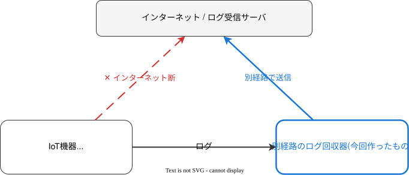
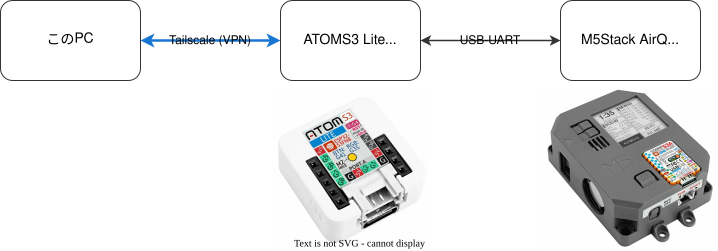

# シリアルログを無線LANでとばす

2026-05-30 Kernel/VM探検隊@関西 12回目
Kenta Ida

<!--
_class: lead
_paginate: false
_header: ""
-->

<style>
img[alt~="center"] { display: block; margin: 0 auto; }
section { font-size: 26px; }
pre { font-size: 17px; }
</style>

## 背景: IoT機器のログをリモートで回収したい

* 業務でESP32等のIoT機器を開発 → **動作中のログ収集**が課題
* IoT機器のログの回収 → サーバーに制御用の通信と合わせて送信
* インターネット接続が生きている間はよいが、切れた場合は？
    * なんで切れるのかインターネット越しにはわからない！切れてるからね！
* 別経路でのログ回収が必要



## ネットワーク経由でのログ回収 (1/2)

* 一般的にはRaspberry PiなどのLinux SBCなどで対応
* Raspberry Piの設定はメンドクサイ、電源の用意もメンドクサイ
* イメージの用意もメンドクサイ、あと最近めっちゃ高い！

* ESP32 (無線機能付きマイコン) があるじゃないか。

## ネットワーク経由でのログ回収 (2/2)

* ESP32-S3でUSB-UART経由でログ読み出し
* 無線LAN経由でログを再送信
* 単純なTCPでの送信に加えて RFC2217 に対応

## RFC2217

* Telnetのオプションプロトコル
* リモートホスト上のシリアルポートを制御するプロトコル
    * データ通信に加えて、ボーレート設定、DTRやRTSの制御
    * まさに今回の用途にぴったり
* pyserialなどが対応している
    * `python -mserial rfc2217://(ホスト):(ポート) 115200` とかでいける

## インターネット経由でのログ回収

* ここまででローカルネットワークでのログ収集は解決
* インターネット経由でログを収集したい！
* ログ受信用の公開ホスト立てる？メンドクサイ…　(Cloudflareでやってもいいけど)
    * → VPNが欲しい
* 別でVPN接続用ノード立てるのも面倒… じゃあESP32でVPNにつなぐか！

## WireGuard for lwIP

* 6年くらい前からlwIP向けのWireGuard実装が存在
    * https://github.com/smartalock/wireguard-lwip
* ESP32向けの移植は昔やった (Arduino用のライブラリにまとめたりもしてた)
* -> WireGuardで行こう。でもノードの探索どうやろう？キーの入力とかメンドイ

## Tailscale

* みんな大好き Tailscale
    * WireGuardを使ったVPNサービス
* ノードの探索、NAT越しでの通信確立、NAT超えられない場合のリレーをやってくれる
* ポチポチするだけでつながるのでめちゃくちゃ便利
* でもESP32で動くの？

## TailscaleのESP32実装

* 動かすのは難しくない。
    * WireGuard -> 実装済み
    * コントロールプレーン -> ノード探索とネットマップ(IP・ピア一覧)の配布。自前実装 (ts2021)
    * NAT越しでの通信確立 -> DISCOでUDP直接経路を探索
    * リレー -> DERPによるHTTPS中継
* Goのリファレンス実装がある

## 実装 (1/2)

* とりあえずGoの実装を参考に必要なものを実装 (Claude Codeが)
* 初期のコード自体は割とすんなり出力された
* 最初は実機向けにコードを書いて確認していたがなかなか動くようにならない
    * ビルド、書き込み、WiFi接続待ち、Tailscale接続処理でTATが長くなる

## 実装 (2/2)

* ESP-IDF (ESP32の開発環境) にはQEMUが用意されている
* MCU内蔵の演算系ペリフェラルやEthernetはエミュレートされる
    * 無線系はエミュレートされない
* ホスト上でlwIPベースでの通信処理の確認が可能
* 何回か自動でくるくる回しているとつながるようになった。

## デモ



* `ATOMS3 Lite` がTailscaleに参加し、`AirQ` のシリアルログをVPN越しに転送

## パフォーマンスなど

* 現状あまり良くない。時々止まる…
* DERPサーバーによるリレー接続しかできていない。

```
$ tailscale status
100.81.135.26    ... active; relay "nyc"; offline, last seen 15h ago, tx 3020 rx 5756
```

* 自宅のネットワーク構成のせいかもしれないが…
* 自宅の外のネットワークから試す必要があるのでちょっと面倒
* この装置自体の遠隔ログ回収が必要

## まとめ

* RFC2217とかいうリモートシリアル制御用の便利プロトコルがある
* Raspberry Piなど無しでESP32単独でTailscaleに接続できる
* ソースはこちら https://github.com/ciniml/serial_wifi_logger
* パフォーマンス改善がんばります…