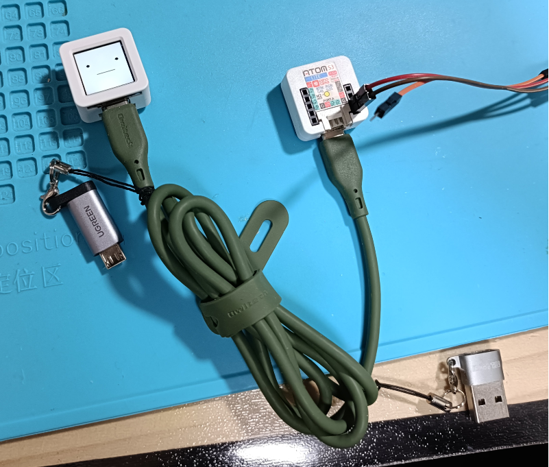
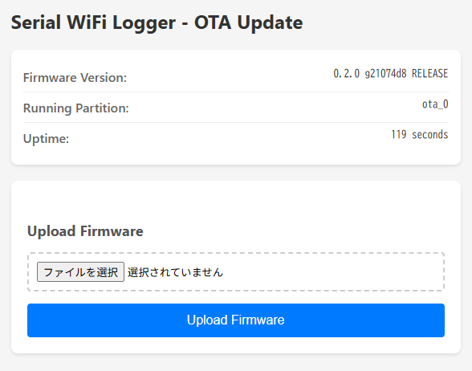

# USB-UART経由のログを<br>ネットワーク経由で回収したい！

<!--
_class: lead
_paginate: false
_header: ""
-->

<style>
img[alt~="center"] {
  display: block;
  margin: 0 auto;
}
</style>

## 背景・課題

* 無線機能付きMCU (Wi-Fi, BLE, Thread等) を使ったIoT機器のデバッグ
    * 通信エラー発生時にシリアルログを見たい
    * **しかし通信自体が切れていると確認できない**
    * 別経路でのログ収集が必要

* ESP32-S3などは **内蔵USB Serial/JTAG** のみ
    * 外部UARTピンを出していない製品が増加
    * 例: **M5AtomS3** など小型モジュール
    * USB経由のログ出力しかできない

## Raspberry Pi等のSBCを使う場合の問題

* USBシリアル + SBC + ser2net などで実現可能だが...

* **サイズが大きい**
    * 設置場所の制約

* **比較的高価**
    * Raspberry Pi + 電源 + ケース + SDカード...

* **SDカードが壊れやすい**
    * 突然の電源断でファイルシステム破損
    * 長期運用での信頼性に不安

## 解決策: Serial WiFi Logger

* ESP32-S3の **USB OTG (ホスト) 機能** を活用
* ターゲットのUSBシリアルを **WiFi経由で転送**
* PCからネットワーク越しにシリアルログを取得可能

```
[ターゲットデバイス] --USB--> [Serial WiFi Logger] ~~WiFi~~> [PC]
     (ESP32-S3等)            (ESP32-S3搭載MCU)               nc/telnet
```

* 対応デバイス
    * CDC-ACM (標準USBシリアル)
    * FTDIチップ (FT232, FT2232等)

## 主な機能

| 機能 | 説明 |
|:-----|:-----|
| USBホスト | CDC-ACM / FTDIデバイスを自動検出 |
| WiFiプロビジョニング | SoftAPで初回設定、以降は自動接続 |
| TCPサーバー | データポート (8888) / 制御ポート (8889) |
| mDNS | `serial-XXXXXX.local` で自動検出 |
| DTR/RTS制御 | 制御ポート経由でシリアル信号を操作 |
| OTA更新 | ブラウザからファームウェア更新 |

## システム構成

```
┌─────────────────┐      USB      ┌─────────────────┐
│ デバッグ対象    │──────────────>│ Serial WiFi     │
│ (ESP32-S3等)    │               │ Logger          │
│                 │               │ (ESP32-S3)      │
│ 内蔵USB         │               │ USB OTG Host    │
│ Serial/JTAG     │               │                 │
└─────────────────┘               └────────┬────────┘
                                           │ WiFi
                                           v
                                  ┌─────────────────┐
                                  │ PC              │
                                  │ nc/telnet       │
                                  │ ポート 8888     │
                                  └─────────────────┘
```

## 構成例: M5Stack AtomS3 Lite

* **M5Stack AtomS3 Lite** (税込 約1,400円)
    * ESP32-S3搭載、24x24mmの超小型モジュール
    * USB Type-Cコネクタ (USB OTGホスト対応)
    * 5V給電でそのまま動作

* 必要なもの
    * AtomS3 Lite本体
    * 5V電源 (AtomS3 Lite給電用)


## 構成例



## 使い方 (1/2)

1. **初回セットアップ**
   * ファームウェア書き込み後、`PROV_XXXXXX` APに接続
   * ブラウザで `192.168.4.1` にアクセスしてWiFi設定

2. **デバイスの検出**
   ```bash
   avahi-browse -rt _serial._tcp
   ```

## 使い方 (2/2)

3. **シリアルログの取得**
   ```bash
   nc serial-XXXXXX.local 8888
   ```

4. **DTR/RTS制御** (制御ポート8889)
   ```
   DTR 1    # DTR = HIGH
   BAUD 115200
   ```

## 動作中


## OTAアップデート

* ブラウザから簡単にファームウェア更新
* `http://serial-XXXXXX.local/` でWebUIにアクセス



* デバイス情報の確認 (バージョン、起動パーティション、稼働時間)
* ファームウェアファイルを選択してアップロード
* 進捗バー表示、完了後自動再起動

## 今後の予定

* **WireGuardによるVPN対応**
    * リモート環境からのセキュアなアクセス
    * NAT越えでの接続が可能に

* **Tailscaleクライアント実装**
    * サクッとVPN張って遠隔地からログ収集・操作

## まとめ

* **Serial WiFi Logger** でUSBシリアル経由のログ収集が容易に
    * USBシリアルをWiFi経由で転送
    * 通信エラー発生時もログ収集可能

* 必要なハードウェア
    * ESP32-S3開発ボード (USB OTG対応)

* https://github.com/ciniml/serial_wifi_logger
* バイナリ配布
    * **M5Burner** で公開済み
    * GitHub Releases